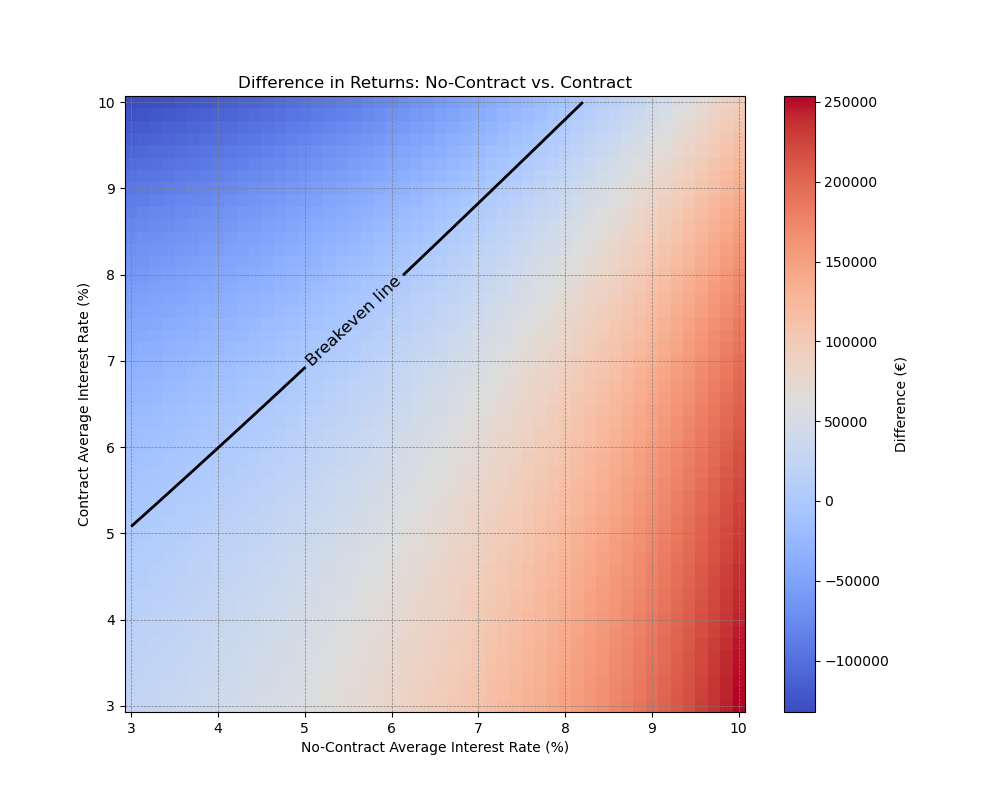
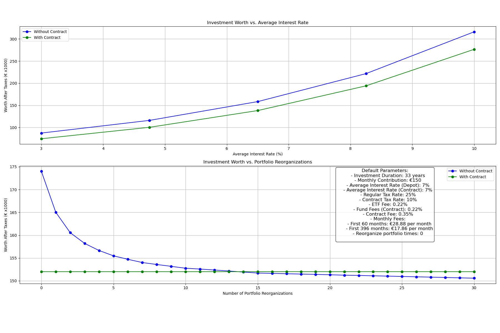

# Compound Interest Simulation for Investment Portfolios

This Python script calculates compound interest over a specified number of years, comparing a simple investement in a depot to a private pension contract in germany. These private contracts often have tax benefits; this program allows to compute whether these tax benefits are offset by the contract fees. This program considering different investment scenarios, tax rates, fees, and portfolio management strategies. 

---

## Features

- **Monthly Contributions**: Handles periodic contributions that can increment annually.
- **Taxable and Non-Taxable Growth**: Separates already taxed gains from untaxed interest for accurate computation.
- **Portfolio Reorganization**: Simulates periodic taxation events due to portfolio restructuring.
- **Fee Structures**: Supports dynamic monthly fees and fund-specific fees (e.g., ETF fees).
- **Custom Tax Rates**: Applies different tax rates for regular and contractual scenarios.
- **Annual Tax-Free Allowances**: Incorporates tax-free allowances into calculations.

---

## Plots

This code can generate visualization helping the interpretation of the simulation




## Requirements

- Python 3.x
- Numpy
- Matplotlib

Install dependencies using:
```bash
pip install matplotlib numpy
```

## How to Use

### Parameters
The `compute_interest` function accepts the following parameters:

- `monthly_rate`: Monthly contribution amount.
- `yrly_interest`: Annual interest rate (as a percentage).
- `yrs`: Duration of the investment in years.
- `rate_increment`: Yearly percentage increase in contributions.
- `reorganize_portfolio_times`: Number of portfolio restructuring events. This triggers taxation.
- `tax_rate`: Tax rate (as a percentage).
- `monthly_fees`: A 2D array specifying monthly fees as tuples: `(number_of_months, fee_amount)`.
- `yrly_taxfree`: Annual tax-free allowance.

### Example Configuration
Adjustable parameters for investment comparison:
```python
yrs = 33  # Investment period in years
montly_rate = 150  # Monthly contribution in euros
dynamic = 0  # Annual contribution increase percentage
avg_interest = 9.1  # Average yearly interest rate (percent)
avg_fond_fees = 1.35  # Average fund fees in contract (percent)
contract_fee = 0.35  # Contract fees (percent)
etf_fee = 1.35  # ETF fees outside of the contract (percent)
steuerfreibetrag = 1000  # Annual tax-free allowance in euros
monthly_fees = [[12 * 5, 28.88], [(60 - 21) * 12, 17.86]]  # Monthly fees in euros
regular_tax_rate = 25  # Regular tax rate (percent)
contract_tax_rate = 10  # Contractual tax rate (percent)
reorganize_portfolio_times = 0  # Number of portfolio restructurings
```

### Licence
This project is licensed under the MIT License. Feel free to use and modify.